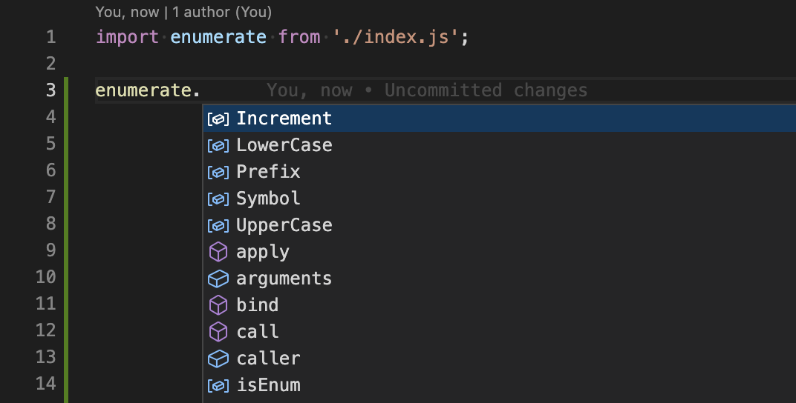
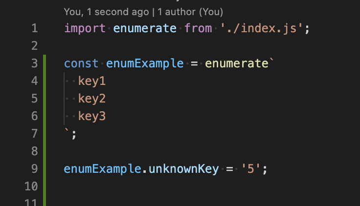
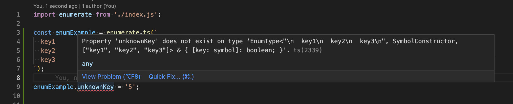
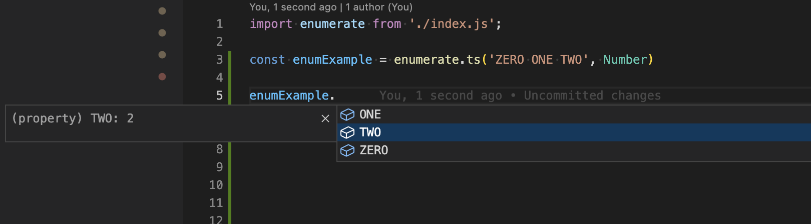

# Easy to use, Symbol-based enum implementation

Just list keys you need and `enumerate` tag function will create an object with corresponding properties and unique values for your convenience.

## Installation

Install with npm:

```
npm install @js-bits/enumerate
```

Install with yarn:

```
yarn add @js-bits/enumerate
```

Import where you need it:

```javascript
import enumerate from '@js-bits/enumerate';
```

or require for CommonJS:

```javascript
const enumerate = require('@js-bits/enumerate');
```

## How to use

Example 1:

```javascript
const { FOOT, METER } = enumerate`FOOT METER`;

const convertToFeet = (value, unit = FOOT) => {
  if (unit === METER) {
    return value * 3.281;
  }
  return value;
};

console.log(`${convertToFeet(5)} feet`); // 5 feet
console.log(`${convertToFeet(2, METER)} feet`); // 6.562 feet
```

Example 2:

```javascript
const STAR_WARS = enumerate`I II III IV V VI`;

const getEpisodeName = episode => {
  const { I, II, III, IV, V, VI } = STAR_WARS;
  switch (episode) {
    case I:
      return 'The Phantom Menace';
    case II:
      return 'Attack of the Clones';
    case III:
      return 'Revenge of the Sith';
    case IV:
      return 'A New Hope';
    case V:
      return 'The Empire Strikes Back';
    case VI:
      return 'Return of the Jedi';
    default:
      return 'Unknown';
  }
};

console.log(getEpisodeName(STAR_WARS.III)); // Revenge of the Sith
console.log(getEpisodeName(STAR_WARS.IV)); // A New Hope
console.log(getEpisodeName(STAR_WARS.X)); // Error: Invalid enum key: X
```

## Primitive enum converters

By default `enumerate` converts values to [Symbols](https://developer.mozilla.org/en-US/docs/Web/JavaScript/Reference/Global_Objects/Symbol):

```javascript
console.log(enumerate`FOOT METER`); // Enum { FOOT: Symbol(FOOT), METER: Symbol(METER) }
```

You can change this behavior by specifying an appropriate converter:

```javascript
console.log(enumerate(String)`FOOT METER`); // Enum { FOOT: 'FOOT', METER: 'METER' }
console.log(enumerate(Number)`ZERO ONE TWO`); // Enum { ZERO: 0, ONE: 1, TWO: 2 }
// or
const enumString = enumerate(String);
const enumNumber = enumerate(Number);
console.log(enumString`FOOT METER`); // Enum { FOOT: 'FOOT', METER: 'METER' }
console.log(enumNumber`ZERO ONE TWO`); // Enum { ZERO: 0, ONE: 1, TWO: 2 }
```

## Advanced enum converters

There are several advanced converters also available.

```javascript
const { LowerCase, UpperCase, Prefix, Increment } = enumerate;

console.log(enumerate(LowerCase)`
VALUE1
VALUE2
VALUE3
`); // Enum { VALUE1: 'value1', VALUE2: 'value2', VALUE3: 'value3' }

console.log(enumerate(UpperCase)`
value1
value2
value3
`); // Enum { value1: 'VALUE1', value2: 'VALUE2', value3: 'VALUE3' }

console.log(enumerate(Prefix('value|'))`x y z`); // Enum { x: 'value|x', y: 'value|y', z: 'value|z' }
// or as a shortcut
console.log(enumerate('value|')`x y z`); // Enum { x: 'value|x', y: 'value|y', z: 'value|z' }

console.log(enumerate(Increment(10))`
VALUE1
VALUE2
VALUE3
`); // Enum { VALUE1: 10, VALUE2: 20, VALUE3: 30 }
// or as a shortcut
console.log(enumerate(10)`VALUE1 VALUE2 VALUE3`); // Enum { VALUE1: 10, VALUE2: 20, VALUE3: 30 }

// the second argument here is a start value (equals to the first argument if not specified)
console.log(enumerate(Increment(10, 19))`
VALUE1
VALUE2
VALUE3
`); // Enum { VALUE1: 19, VALUE2: 29, VALUE3: 39 }
```

## Customization

Or you can implement your custom converter:

```javascript
const customEnum = enumerate((acc, item) => {
  acc[`-${item}-`] = `-${(Object.keys(acc).length + 1) * 10}-`;
  return acc;
});

console.log(customEnum`
  CODE1
  CODE2
  CODE3
`); // Enum { '-CODE1-': '-10-', '-CODE2-': '-20-', '-CODE3-': '-30-' }
```

But remember that only default behavior guarantees global uniqueness of enumerated values.

## enumerate.isEnum()

You can also check if the given object is a enum or not.

```javascript
console.log(enumerate.isEnum({ a: 1, b: 2, c: 3 })); // false
console.log(enumerate.isEnum(enumerate`a b c`)); // true
```

## Type-safety and IntelliSense (code completion)

The package includes a TypeScript Declaration File and supports VS Code IntelliSense features.



But there is one caveat. In order to achieve full type safety you have to use a bit different syntax. Unfortunately.
So, instead of using `enumerate()` directly as a [tag function](https://developer.mozilla.org/en-US/docs/Web/JavaScript/Reference/Template_literals#tagged_templates) you can use `enumerate.ts()` function.

Compare



versus



For example

```javascript
enumerate.ts('ZERO ONE TWO', Number); // Enum { ZERO: 0, ONE: 1, TWO: 2 }
```

does exactly the same as

```javascript
enumerate(Number)`ZERO ONE TWO`; // Enum { ZERO: 0, ONE: 1, TWO: 2 }
```

but it allows TypeScript to recognize the result type.



The reason of why we cannot use `enumerate` directly is that there is a long-standing TypeScript [issue](https://github.com/microsoft/TypeScript/issues/33304) with [TemplateStringArray](https://microsoft.github.io/PowerBI-JavaScript/interfaces/_node_modules_typedoc_node_modules_typescript_lib_lib_es5_d_.templatestringsarray.html) being incorrectly typed and, as result, not being able to be parameterized.

## Notes

- Be careful adding new items to an existing numeric enum. Always append them to the end of the list to avoid changing previous item values.
- Requires TypeScript 4.8+ for best type safety features support.
